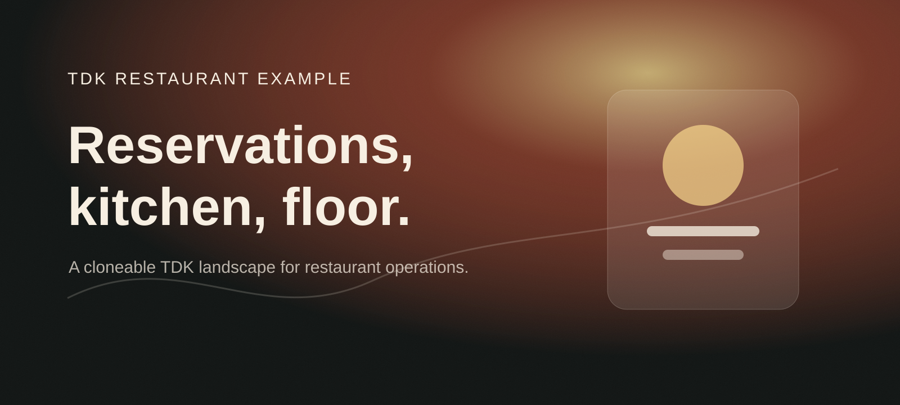
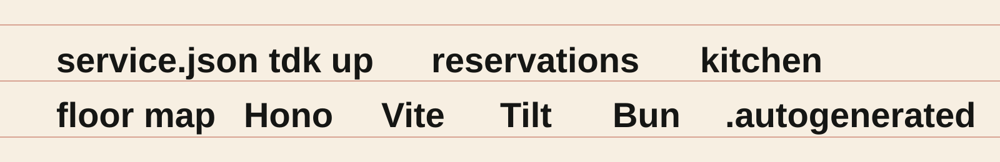
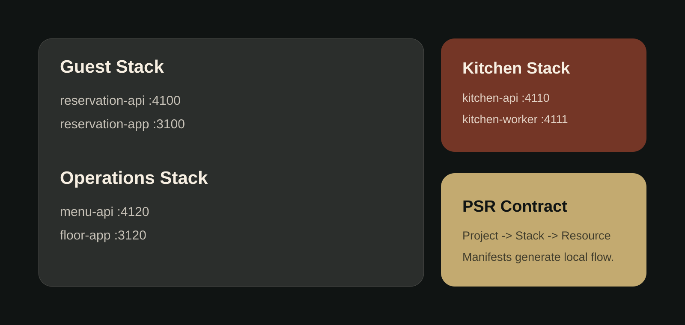
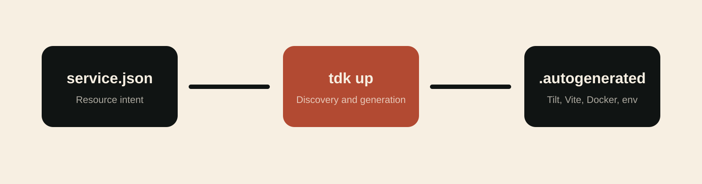

<!-- markdownlint-disable MD013 MD033 MD041 -->

<p align="center">
  
</p>

<p align="center">
  <a href="#run-it">Run it</a>
  &nbsp;&nbsp;/&nbsp;&nbsp;
  <a href="#the-landscape">Explore the landscape</a>
  &nbsp;&nbsp;/&nbsp;&nbsp;
  <a href="#generation">Understand generation</a>
  &nbsp;&nbsp;/&nbsp;&nbsp;
  <a href="#demo-walkthrough">Demo Walkthrough</a>
  &nbsp;&nbsp;/&nbsp;&nbsp;
  <a href="https://github.com/tdk-landscape/tdk-cli">TDK CLI</a>
</p>

<br>

## Restaurant Operations in One Clone

This repository is a polished TDK **Project-Stack-Resource (PSR)** example for restaurant teams: reservations, waitlist intake, kitchen throughput, menu availability, and floor control split into independently runnable resources.

You declare each restaurant service in a compact `service.json`. TDK discovers the landscape, resolves resource dependencies, allocates ports, and generates local Docker, Vite, environment, and TypeScript plumbing inside `.autogenerated/`.

<p align="center">
  
</p>

## Run It

### Prerequisites

- [Docker](https://docs.docker.com/get-docker/) is running.
- [Tilt](https://docs.tilt.dev/install.html) is installed.
- [Bun 1.2+](https://bun.sh/docs/installation) is installed.
- [TDK CLI](https://github.com/tdk-landscape/tdk-cli#installation) is available as `tdk`.

```bash
git clone https://github.com/tdk-landscape/tdk-restaurant-example.git
cd tdk-restaurant-example
tdk up
```

TDK starts all three stacks from their resource manifests.

```bash
# Start one restaurant domain stack
tdk up guest
tdk up kitchen
tdk up operations

# Inspect the running landscape
tdk status

# Stop the landscape
tdk down
```

## The Landscape

<p align="center">
  
</p>

| Stack | Resource | Type | Runtime | Port | Dependencies | Primary Capability |
| --- | --- | --- | --- | ---: | --- | --- |
| **guest** | [`reservation-api`](services/guest/reservation-api) | Backend API | Hono 4 / Bun | [`4100`](http://localhost:4100/health) | None | Reservations, waitlist, and table holds |
| **guest** | [`reservation-app`](services/guest/reservation-app) | Frontend App | Vite 5 / React | [`3100`](http://localhost:3100) | `reservation-api` | Guest booking and host stand screen |
| **kitchen** | [`kitchen-api`](services/kitchen/kitchen-api) | Backend API | Hono 4 / Bun | [`4110`](http://localhost:4110/health) | None | Tickets, stations, and service pacing |
| **kitchen** | [`kitchen-worker`](services/kitchen/kitchen-worker) | Background Worker | Bun Worker | [`4111`](http://localhost:4111/health) | `kitchen-api` | Ticket aging and course-fire signals |
| **operations** | [`menu-api`](services/operations/menu-api) | Backend API | Hono 4 / Bun | [`4120`](http://localhost:4120/health) | None | Menu availability, modifiers, and item 86s |
| **operations** | [`floor-app`](services/operations/floor-app) | Frontend App | Vite 5 / React | [`3120`](http://localhost:3120) | `menu-api`, `reservation-api` | Floor map and nightly operations view |

```text
tdk-restaurant-example/
├── Tiltfile
├── TILT_SERVICE_DEFAULTS.star
├── TILT_TECH_STACK.star
├── DEMO_GUIDE.md
├── docs/
│   ├── readme-hero.svg
│   ├── readme-marquee.svg
│   ├── readme-bento.svg
│   └── readme-flow.svg
└── services/
    ├── guest/
    │   ├── reservation-api/
    │   └── reservation-app/
    ├── kitchen/
    │   ├── kitchen-api/
    │   └── kitchen-worker/
    └── operations/
        ├── menu-api/
        └── floor-app/
```

## Generation

<p align="center">
  
</p>

Every restaurant resource owns a compact declarative manifest:

```json
{
  "appName": "reservation-api",
  "appType": "backend",
  "stack": "guest",
  "port": 4100,
  "dependsOn": [],
  "healthCheck": {
    "enabled": true,
    "path": "/health"
  }
}
```

Running `tdk up` turns those manifests into local orchestration files for Tilt, Docker, Vite, and Bun.

> [!IMPORTANT]
> Edit `service.json`, `TILT_SERVICE_DEFAULTS.star`, or `TILT_TECH_STACK.star`. Never edit `.autogenerated/` directly; TDK regenerates its contents.

## Project, Stack, Resource

| Level | Meaning in TDK Restaurant Operations | Command Surface |
| --- | --- | --- |
| **Project** | The entire restaurant demo landscape | `tdk up`, `tdk down`, `tdk status` |
| **Stack** | A restaurant business area: `guest`, `kitchen`, or `operations` | `tdk up guest` |
| **Resource** | One API, web console, or worker process | `tdk resource <name> ...` |

## Demo Walkthrough

Open [DEMO_GUIDE.md](DEMO_GUIDE.md) for a three-minute walkthrough that shows how a host stand, kitchen pass, and manager floor view can be split into TDK resources without hand-wiring local orchestration.

## Testing Individual Resources

Each resource is standalone and testable:

```bash
cd services/guest/reservation-api
bun install
bun run typecheck
```

---

<p align="center">
  <strong>Declare the restaurant. Generate the landscape. Keep service moving.</strong>
</p>

<p align="center">
  <a href="https://github.com/tdk-landscape">TDK Landscape</a>
  &nbsp;&nbsp;/&nbsp;&nbsp;
  <a href="https://github.com/tdk-landscape/tdk-cli">CLI</a>
  &nbsp;&nbsp;/&nbsp;&nbsp;
  <a href="DEMO_GUIDE.md">Demo Guide</a>
  &nbsp;&nbsp;/&nbsp;&nbsp;
  MIT License
</p>
